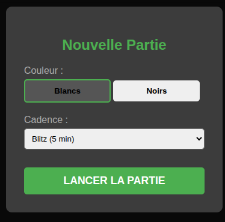
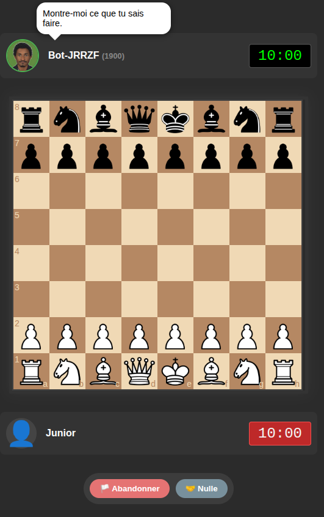
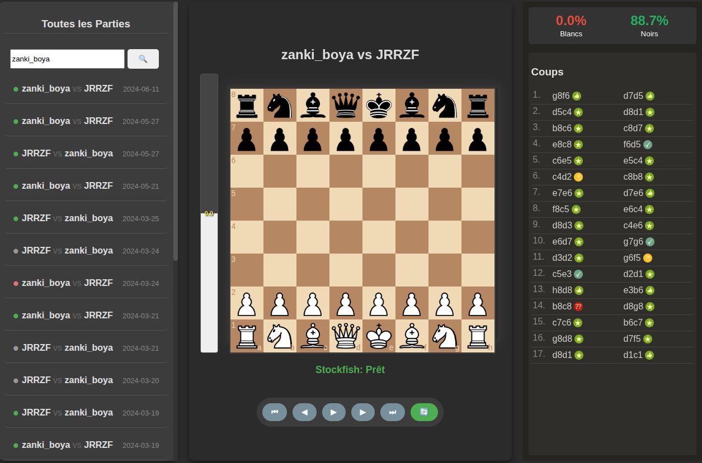
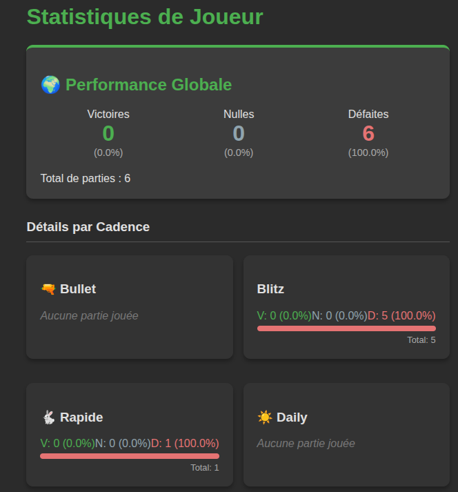
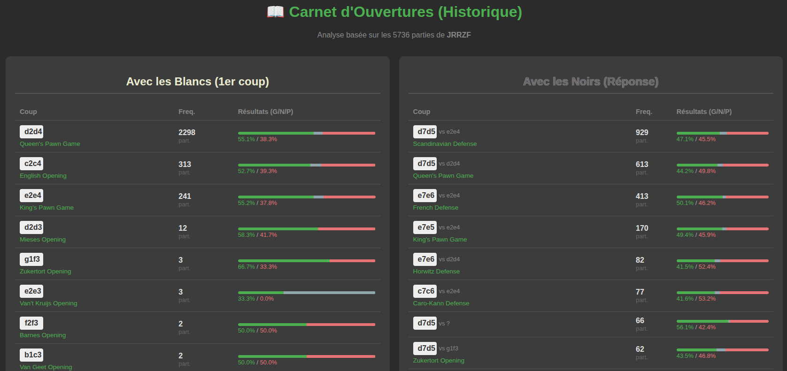
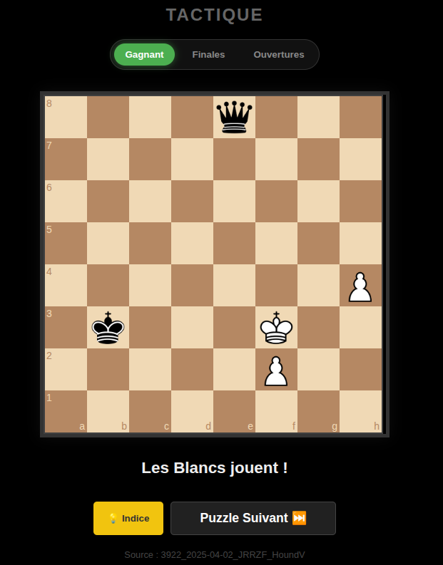

# JRRZF Bot - Moteur d'Échecs Personnalisé

Ce projet est un moteur d'échecs hybride conçu pour simuler un style de jeu spécifique basé sur un historique de parties, avec un repli sur Stockfish pour les positions inconnues. L'application repose sur une architecture microservices alliant la robustesse de Java Spring Boot pour le backend et la flexibilité de Python pour l'interface avec le moteur d'IA.

---

## Architecture Technique

Le projet est divisé en trois composants principaux :

1.  **Backend (Java Spring Boot 3.2.2)** :

    * Gère l'API REST, l'authentification, la logique métier et les interactions avec la base de données.

    * Orchestre les décisions : vérifie si un coup existe dans la base "historique" ou sollicite le module Python.

2.  **Moteur IA (Python)** :

    * Interface directe avec l'exécutable Stockfish.

    * Fournit l'évaluation des positions (FEN) et les meilleurs coups.
3.  **Base de Données (PostgreSQL)** :

    * Stocke les utilisateurs, les parties jouées sur la plateforme (`platform_games`) et l'historique des coups importés (`moves`).

---

## Prérequis en local

Si vous voulez le lancer sans docker, voici les prérequis :

* **Système** : Linux (recommandé) ou Windows.
* **Java** : JDK 21.
* **Python** : Version 3.10+.
* **Base de données** : PostgreSQL.
* **Moteur** : Stockfish installé au niveau système.
* **Build** : Maven.

## Docker

Le conteneur Docker inclut déjà l'intégralité de l'environnement nécessaire au fonctionnement de l'application. Cette solution vous dispense de toute configuration manuelle et assure un déploiement rapide.

### Côté linux :

Une installation guidé est fournie sur le lien : https://docs.docker.com/engine/install/ubuntu/


### Côté Windows :

Une installation guidé est fournie sur le lien : https://docs.docker.com/desktop/setup/install/windows-install/

## Lancer l'application

Une fois docker installé, lancez dans le terminal la commadne suivante :

```bash
docker compose up --build -d
```

**Accédez à l'application** : Ouvrez votre navigateur et allez sur :  http://localhost:8082

Deux utilisateurs sont disponibles :

```text
username    Password    
Martin  	Ineverdo0209
Junior  	Chess@md91
```

**Arrêter l'application** :

```bash
docker compose down
```
---

## Fonctionnalités

- **Mimétisme de jeu** : Le bot privilégie les coups issus de la base de données historique (5700+ parties importées). Il reproduit ainsi le répertoire d’ouvertures et les tendances stratégiques du joueur.

- **Mode compétitif** : Lorsqu’aucune donnée historique ne correspond à la position courante, le bot bascule automatiquement sur Stockfish configuré à depth=10 (≈1900 Elo) afin de garantir un niveau de jeu stable.

- **Analyse post-partie** : Chaque partie peut être réanalysée avec Stockfish pour mesurer la précision des coups, détecter les erreurs majeures et identifier les opportunités manquées.

- **Statistiques** : Un tableau de bord synthétise les performances globales : résultats par cadence (Bullet, Blitz, Rapide), par couleur, taux de victoire, nulles et défaites.

- **Explorateur d’ouvertures** : Un module dédié permet de visualiser les ouvertures jouées, leurs fréquences d’apparition et les taux de victoire associés aux premiers coups.

---

## Intégration Continue (CI) & Tests

Le projet utilise Jenkins pour automatiser la validation du code. Ce pipeline agit comme une barrière de sécurité : une nouvelle fonctionnalité n'est intégrée que si elle ne casse pas l'existant.

### Le Flux de Validation

À chaque modification du code (`Push`), Jenkins exécute automatiquement les étapes suivantes :

- **Compilation** : Vérifie que le code Java est syntaxiquement correct.

- **Tests Unitaires** (`mvn test`) : Vérifie la logique du Bot, les règles d'échecs et les calculs de statistiques.

- **Build** (`mvn package`) : Si et seulement si les tests réussissent, Jenkins génère le fichier exécutable .jar.

---

## Présentation du jeu : Les Echecs

Je ne suis que joueur ammateur donc je vais expliquer ce que j'ai compris en général.

Les echecs c'est un jeu de plateau de 8 cases par 8 cases dont :

- en colonnes on trouve des lettres allant de `a` à `h`

- en lignes ce sont les chiffres allant de `1` à `8`


Le but du jeu est de `mater` le roi adverse. Un roi est dit échec et mat lorsqu’il est en échec et qu’aucun coup légal, ni du roi ni d’une autre pièce, ne permet de lever cet échec.

Cette situation est souvent confondue avec le `pat`, où le roi n’est ni en échec ni mat, mais où le joueur n’a aucun coup légal à jouer alors que c’est à lui de jouer ; la partie est alors déclarée **nulle**.

### Les notations chesscom

Les notations du jeu sont en anglais et ça porte confusion si on ne sait pas.

- K : King (le roi)

- Q : Queen (la reine)

- R : Rook (la tour)

- N : Knight (le cavalier)

- B : Bishop (le fou)

Les pions sont directement représentés selon la ligne et la colonne où ils se trouvent.

### La position de départ

Vous avez :

- 8 pions : seconde rangée (pour les blancs) et septième rangée (pour les noirs)

- 1 Roi : placé en e1 (pour les blancs) et e8 (pour les noirs)

- 1 Reine : placé en d1 (pour les blancs) et d8 (pour les noirs)

- 2 Tours : en a1 et h1 (pour les blancs) et a8 et h8 (pour les noirs)

- 2 cavaliers : en b1 et g1 (pour les blancs) et b8 et g8 (pour les noirs)

- 2 fous : en c1 et f1 (pour les blancs) et c8 et f8 (pour les noirs)


### PGN

Un fichier sous un format `.pgn` (**P**ortable **G**ame **N**otation) récupéré de la plateforme https://www.chess.com/ a une structure comme suite :

```pgn
[Event "Live Chess"]  <-- partie en temps réel
[Site "Chess.com"]    <-- site du jeu
[Date "2025.07.22"]   <-- date à laquelle la partie a été jouée
[Round "-"]   <-- pas de valeur parce que c'était pas en tournoi
[White "user_name"]  <-- utilisateur avec les pièces blanches
[Black "user_name"]  <-- utilisateur avec les pièces noires
[Result "0-1"]   <-- résultats de la partie
[WhiteElo "1850"]  <-- le classement elo du joueur aux blancs
[BlackElo "1844"]  <-- le classement elo du joueur aux noirs
[TimeControl "180"]   <-- la cadence de la partie (180 secondes ici)
[EndTime "17:22:21 GMT+0000"]  <-- l'heure à laquelle la partie s'est terminée
[Termination "user_name won by checkmate"]   <-- Comment la partie s'est terminée

1. d4 e6 2. Nf3 d5 3. Bf4 Nf6 4. e3 c5 5. Be2 Nc6 6. dxc5 Bxc5 7. c3 Qb6 8. Qc2
Bd7 9. Be5 Nxe5 10. Nxe5 Bd6 11. Nxd7 Nxd7 12. O-O O-O 13. Nd2 Rac8 14. Nf3 h6
15. h3 Ne5 16. Rfd1 Nxf3+ 17. Bxf3 a6 18. Rd4 Be5 19. Rb4 Qc7 20. Qb3 b5 21. a4
Bd6 22. Rd4 Rb8 23. axb5 Rxb5 24. Qa4 Rxb2 25. Qxa6 Rfb8 26. Rb4 Bxb4 27. cxb4
R2xb4 28. Rf1 Rb1 29. Be2 Rxf1+ 30. Bxf1 Rc8 31. h4 Qc1 32. g3 Rc2 33. Qa8+ Kh7
34. Qf8 Qe1 35. Qxf7 Rc1 36. Kg2 Qxf1+ 37. Kf3 Qh1+ 38. Kf4 Qe4# 0-1
```

Explication des notations (pas en entier vu que ça prendrait trop de lignes) :

- 1. d4 e6 : le 1 représente le premier coup (comment la partie a debuté). d4 représente la ligne **4** et la colonne **d** (coup joué par les blancs). e6 représente la ligne **6** et la colonne **e** (coup répondu par les noirs).

- Les symbôles :

    - \+ : c'est pour dire que le roi est en echec (le roi est menacé sur sa position)

    - x : ça veut dire capture (par exemple `Qxf7` : Queen captures a pawn on line 7 and column f).

    - O-O : veut dire petit roque (le roi part se cacher), l'action se fait avec la tour (noté R).

    - \# : c'est le signe de l'echec et mat (le roi est en echec mais n'a plus de case de fuite alors que c'est à son tour de jouer).

## Présentation de l'application

L'application a 6 sections sous forme de carte :

### JOUER : Affronter le bot

Lance une nouvelle partie contre le JRRZF Bot. Vous choisissez votre couleur et la cadence (Blitz, Rapide, etc.). Le bot adaptera son style : il jouera vos coups historiques si la position est connue, ou utilisera Stockfish (niveau 1900) si elle est inconnue.





---

### ANALYSE (Revoir mes parties & Erreurs)

Permet de charger une partie terminée pour la soumettre au moteur Stockfish. L'outil identifie vos erreurs (blunders), imprécisions et les occasions manquées, avec une courbe d'évaluation en temps réel.



---

### PROFIL (Résultat affrontement)

Votre tableau de bord personnel. Il affiche vos statistiques de performance contre le bot : nombre de victoires, défaites et nulles, triées par type de cadence (Bullet, Blitz, Rapide).



---

### OUVERTURES (Mon répertoire) 

Un outil d'exploration basé sur vos 5700+ parties historiques. Il vous montre quels premiers coups vous jouez le plus souvent et quel est votre taux de réussite (Winrate) pour chaque ouverture, avec les Blancs et les Noirs.



---

### PARTIES (Revoir l'historique)

L'archivage complet de vos matchs joués sur cette application. Vous pouvez y rechercher une partie spécifique, voir le résultat et rejouer les coups un par un.


---

### ENTRAÎNEMENT (Tactiques & Puzzles) 

Un mode dédié à la progression tactique. Le système vous propose des puzzles d'échecs (ex: "Les Blancs jouent et gagnent") pour vous entraîner à repérer des combinaisons gagnantes.



---

## Problème probable

- Le chrono pendant la partie contre le bot est mal synchronisée

- Le calcul dans Analyse de type Bilan de partie n'est pas précise façon celle de chess.com :

    - absence de détection des coups `BRILLANT` et les coups `GREAT`

    - une faille probable sur la détection des coups `BLUNDER` (les écarts pour considérer en tant que blunder sont pas précis)